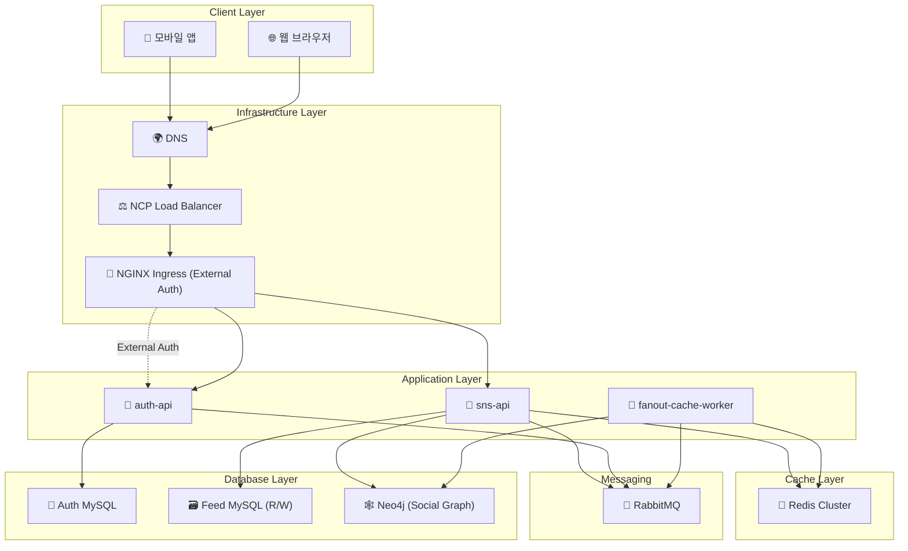

# 뉴스피드 시스템 (Newsfeed System)

> "가상 면접 사례로 배우는 대규모 시스템 설계 기초" 책을 기반으로 한 분산 뉴스피드 시스템 구현

## 📋 프로젝트 개요

대규모 뉴스피드 시스템의 핵심 기능을 분산 환경에서 구현하여 시스템 설계 원리를 학습합니다.
NCP(Naver Cloud Platform) 환경에서 캐시, 메시지 큐 연동을 통한 확장 가능한 아키텍처를 구축합니다.

## 🏗️ 시스템 아키텍처



### 🔄 분산 처리 흐름

#### 인증/인가 처리 (옵션 2: NGINX External Auth)

1. **클라이언트**: JWT 토큰을 Authorization 헤더에 포함하여 요청
2. **Ingress Gateway**: `auth-api /auth/verify`에 External Auth 호출로 토큰 검증
3. **헤더 추가**: 검증 성공 시 Ingress가 `X-User-Id`, `X-User-Signature` 헤더를 백엔드로 전달
4. **서비스 처리**: `sns-api`는 서명 검증 후 사용자 ID를 신뢰하여 처리

#### 사용자 등록 시

1. **auth-api**: 사용자 정보를 **Auth MySQL**에 저장
2. **메시지 발행**: RabbitMQ에 `user.registered` 이벤트 전송
3. **Fanout Worker**: 이벤트 수신 후 사용자 프로필 테이블에 기본 정보 생성
4. **사용자 동기화**: auth-api의 사용자 정보가 sns-api에 실시간 동기화

#### 포스트 생성 시

1. **Ingress Gateway**: External Auth 성공 시 `X-User-Id` 헤더 추가 → 인증 완료된 요청만 `sns-api`로 전달
2. **sns-api**: 포스트를 **Feed MySQL Master**에 저장 (Write Operation)
3. **메시지 발행**: RabbitMQ에 `post.created` 이벤트 전송
4. **fanout-cache-worker**: 이벤트 수신 후 **Graph DB**에서 작성자의 팔로워(또는 구독자) 목록 조회 (Read Operation)
5. **캐시 업데이트**: 각 팔로워의 뉴스피드 캐시에 새 포스트 추가

#### 포스트 삭제 시

1. **Ingress Gateway**: External Auth 성공 시 `X-User-Id` 헤더 추가
2. **sns-api**: **Feed MySQL Master**에서 포스트 삭제 (Write Operation)
3. **메시지 발행**: RabbitMQ에 `post.deleted` 이벤트 전송
4. **Fanout Worker**: 모든 팔로워의 뉴스피드 캐시에서 해당 포스트 제거

#### 뉴스피드 조회 시 (캐시 우선 전략)

1. **Ingress Gateway**: External Auth 성공 시 `X-User-Id` 헤더 추가
2. **캐시 조회**: 개인 뉴스피드 및 포스트 콘텐츠를 캐시에서 우선 조회
3. **Cache Miss 처리**: 미스 시 **Feed DB**에서 조회한 뒤 캐시에 저장
4. **보조 캐시 활용**: 소셜 프로필/카운터 등 조회 시 캐시 우선 사용

#### 팔로우/언팔로우 시

1. **Ingress Gateway**: External Auth 성공 시 `X-User-Id` 헤더 추가
2. **sns-api**: 
   - `X-User-Id`에서 userA_id 확인
   - `{userId}` 파라미터에서 userB_id 확인
   - **사용자 유효성 확인**: 사용자 상태/프로필 캐시 확인(미스 시 auth-api 조회로 보강)
   - **관계 저장소**: 팔로우/언팔로우를 **Graph DB**에 반영 (Write)
3. **메시지 발행**: RabbitMQ에 `user.followed`/`user.unfollowed` 이벤트 전송
4. **Fanout Worker**: 뉴스피드 캐시 재구성

#### 데이터베이스 분리

- **Auth Database**: 사용자 계정, 권한, 토큰 관리 전용
- **Feed Database**: 포스트, 팔로우 관계, 뉴스피드 전용
- **독립적 확장**: 각 도메인별로 독립적인 스케일링 가능

## 🛠️ 기술 스택

### Backend

- **Language**: Java 24
- **Framework**: Spring Boot 3.5.4
- **Build Tool**: Gradle

### Database

- **Primary**: MySQL 8.0 (Master-Slave 구조)
  - **Master**: Write 전용 (포스트/사용자/팔로우 생성/수정/삭제)
  - **Slave**: Read 전용 (뉴스피드/사용자정보/팔로워목록 조회)
- **Test**: H2 Database

### Cache & Message Queue

- **Cache**: Redis 7
- **Message Queue**: RabbitMQ 3

### ORM & Data Access

- **ORM**: Spring Data JPA
- **Provider**: Hibernate

### Testing

- **Framework**: JUnit 5
- **Integration**: Spring Boot Test

### Infrastructure

- **Cloud**: NCP (Naver Cloud Platform)

## 🔌 API 명세

아래 명세는 Ingress External Auth(옵션 2) 전제를 따릅니다. 모든 보호된 엔드포인트는 Ingress가 `X-User-Id`, `X-User-Signature`를 주입합니다.

### auth-api
- Base: `/auth`
- 공개 엔드포인트
  - `POST /auth/register`: 회원가입
  - `POST /auth/login`: 로그인, `accessToken`, `refreshToken` 반환
  - `POST /auth/refresh`: 토큰 갱신
  - `GET /.well-known/jwks.json`: JWKS 공개 키셋
- 내부/Ingress-연동 엔드포인트
  - `GET /auth/verify`: External Auth 용. 유효 토큰 시 200과 함께 헤더 반환
    - Response headers: `X-User-Id`, `X-User-Signature`
  - `POST /auth/logout`: 로그아웃(토큰 무효화, 선택)
  - `DELETE /auth/users/{userId}`: 사용자 탈퇴

### sns-api
- Base: `/api`
- 피드/포스트
  - `POST /api/feeds`: 포스트 생성 (필수 헤더: `X-User-Id`)
  - `GET /api/feeds`: 개인 뉴스피드 조회 (필수 헤더: `X-User-Id`)
  - `DELETE /api/feeds/{postId}`: 포스트 삭제 (필수 헤더: `X-User-Id`)
- 사용자/팔로우
  - `GET /api/users/{userId}`: 사용자 프로필 조회
  - `GET /api/users/{userId}/following`: 팔로잉 목록
  - `GET /api/users/{userId}/followers`: 팔로워 목록
  - `POST /api/users/{userId}/follow`: 팔로우 (필수 헤더: `X-User-Id` = follower)
  - `DELETE /api/users/{userId}/follow`: 언팔로우 (필수 헤더: `X-User-Id` = follower)

인증 요구: 위 보호 엔드포인트들은 Ingress External Auth 성공 후에만 접근 가능.

### fanout-cache-worker
- HTTP 공개 엔드포인트 없음 (내부 컨슈머)
- 메시지 큐 소비 이벤트
  - `post.created`
  - `post.deleted`
  - `user.followed`
  - `user.unfollowed`
  - `user.registered`
  - `user.deleted`
- 동작: 메시지 consume → Graph DB/DB 조회 → Redis 캐시 fan-out 업데이트

## 🏛️ 주요 컴포넌트

### 1. Ingress Gateway (NGINX External Auth)

- **External Auth**: 모든 요청을 `auth-api /auth/verify`로 위임하여 토큰 유효성 검사
- **인증 헤더 주입**: 검증 성공 시 `X-User-Id`, `X-User-Signature`를 백엔드로 전달
- **Rate Limiting/라우팅**: Ingress에서 경로/호스트 기반 라우팅 및 레이트리밋 적용

### 2. auth-api (별도 프로젝트)

- **사용자 등록/탈퇴**: 계정 관리
- **로그인/로그아웃**: JWT 토큰 발급 및 무효화
- **토큰 갱신**: Access Token 갱신
- **권한 관리**: 사용자 권한 및 역할 관리

### 3. sns-api

- **포스트 관리**: CRUD 작업 (Header의 X-User-Id 사용)
- **뉴스피드 생성**: 팔로워 기반 뉴스피드 구성
- **팔로우/언팔로우**: 사용자 관계 관리
- **캐시 전략**: Redis를 활용한 성능 최적화

### 4. Cache Layer (Redis Cluster)

<!-- 캐시 키 설계 등 세부 내용은 개발 진행시 문서화 예정 -->

### 5. Message Queue (RabbitMQ)

- **이벤트 타입**:
  - `post.created`: 포스트 생성 시 팔로워들의 뉴스피드 캐시 업데이트
  - `post.deleted`: 포스트 삭제 시 팔로워들의 캐시에서 제거
  - `user.followed`: 팔로우 시 뉴스피드 재구성
  - `user.unfollowed`: 언팔로우 시 뉴스피드에서 해당 사용자 포스트 제거
  - `user.registered`: 새 사용자 등록 시 초기 데이터 설정
  - `user.deleted`: 사용자 탈퇴 시 관련 데이터 정리
- **처리 방식**: Fanout Exchange를 통한 다중 팔로워 처리

## 📂 프로젝트 구조

루트에 독립 배포 가능한 스프링부트 프로젝트 3개를 배치합니다.

```
Virtual-Interview-01/
  ├─ auth-api/                # 인증/인가 서비스 (회원가입, 로그인, 권한)
  ├─ sns-api/                 # 피드/팔로우/뉴스피드 API
  ├─ fanout-cache-worker/     # MQ consume, 분산 Redis 캐시 fan-out 업데이트
  └─ deploy/
      └─ helm/
          ├─ auth-api/
          │   ├─ Chart.yaml
          │   ├─ values.yaml
          │   └─ templates/ (Deployment, Service, HPA, ConfigMap, Ingress 등)
          ├─ sns-api/
          │   ├─ Chart.yaml
          │   ├─ values.yaml
          │   └─ templates/
          └─ fanout-cache-worker/
              ├─ Chart.yaml
              ├─ values.yaml
              └─ templates/
```

## 🔐 권장 설계: X-User-Id 검증 전략 (분산 환경)

목표: 각 서비스가 매 요청마다 auth-api에 동기 호출하지 않도록 하면서도 신뢰경계를 유지.

- Ingress Gateway에서 External Auth(또는 자체 JWT 플러그인)로 검증 후 `X-User-Id` 최소 클레임을 추가
- 위변조 방지를 위해 `X-User-Id-Signature`(예: HMAC/서명 헤더)를 함께 첨부
- 내부 서비스(sns-api 등)는 공유키/공개키로 서명을 검증하고 신뢰
- 옵션 A: 원본 JWT 자체를 서비스에 전달하고 서비스에서 자체 검증(캐시된 JWKS 사용)
- 옵션 B: 토큰 인트로스펙션 엔드포인트(auth-api)를 두되, aggressive caching(예: 1~5분) 적용

권장안: 게이트웨이 검증 + 서명된 `X-User-Id` 전달을 기본으로 하고, 서비스에서는 서명 검증만 수행. 고위험 엔드포인트에 한해 JWT 재검증(옵션 A) 또는 단기 캐시 인트로스펙션(옵션 B)을 병행.

## 👥 소셜 그래프 설계 권장

- 관계 저장은 **Graph DB(Neo4j)** 를 정본으로 사용
- sns-api는 사용자 유효성만 Redis 캐시(`user:{id}:status`, `user:{id}:profile`)로 확인
- 캐시 미스 시 auth-api 조회 후 캐시 채움(Event 기반 동기화 권장: `user.registered`, `user.deleted` 등)
- 팔로우/언팔로우 질의, 추천, 공통 이웃 탐색 등은 Graph DB에 질의
- 카운터/타임라인은 Redis로 분리하여 읽기 성능 최적화

## 🚢 배포 (Naver Cloud Platform NKS + Helm) 개요

- 각 서비스별 Helm 차트 작성: `deploy/helm/<service>`
- 공통 값: 이미지 레포지토리, 리소스 요청/제한, liveness/readiness 프로브, HPA, 로깅/메트릭 어노테이션
- Ingress: NCP Load Balancer 연동, Ingress Controller(nginx/kong/envoy) Chart 구성 권장
- 외부 리소스:
  - Redis(Cluster/Shard): 별도 Helm(예: Bitnami) 또는 매니지드 서비스
  - RabbitMQ: Helm 또는 매니지드
  - MySQL: 운영 요구에 따라 Operator/매니지드
  - Neo4j: Helm(엔터프라이즈/커뮤니티) 선택
- 시크릿: NCP Secret Manager 또는 Kubernetes Secrets + SealedSecrets
- Observability: Cloud Insight + Prometheus/Grafana 설치 옵션

### Service 공개 정책
- `sns-api`: 필요 경로만 Ingress로 공개, `Service`는 `ClusterIP`
- `auth-api`: `/auth/*`, `/.well-known/jwks.json` 등 선택 공개, `Service`는 `ClusterIP`
- `fanout-cache-worker`: 외부 미공개(ingress 미생성), `Service`는 `ClusterIP`

## 🎯 개발 목표

1. **분산 시스템 설계**: 여러 서비스 간의 통신과 데이터 일관성
2. **캐시 전략**: Redis를 활용한 성능 최적화
3. **비동기 처리**: RabbitMQ를 통한 메시지 큐 활용
4. **확장성**: 대용량 트래픽 처리를 위한 아키텍처 설계

## 🚀 개발 단계

1. **Phase 1**: 기본 Feed API 구현 (포스트 CRUD, 팔로우/언팔로우)
2. **Phase 2**: Redis 캐시 연동 (뉴스피드 캐시)
3. **Phase 3**: RabbitMQ 메시지 큐 연동 (Fanout Worker)
4. **Phase 4**: auth-api 구현 (별도 프로젝트)
5. **Phase 5**: Ingress External Auth 연동 (auth-api /auth/verify, 서명된 X-User-Id 헤더 주입)
6. **Phase 6**: NCP 환경 배포 및 테스트

## 📝 주요 특징

- **캐시 우선 전략**: 뉴스피드 조회 시 DB 대신 캐시 우선 사용
- **5계층 캐시 구조**: 뉴스피드, 콘텐츠, 소셜그래프, 행동, 카운터
- **분산 캐시**: Redis Cluster를 통한 고가용성 및 확장성
- **실제 구현**: 분산환경 캐시 서버에 맞춘 구현

<!-- 구현 예시는 실제 개발 단계에서 추가 예정 -->

## 🔧 로컬 개발 환경 구성

```bash
# 1. Git 클론
git clone https://github.com/Yoon-HP/Virtual-Interview-01.git

# 2. 의존성 설치
./gradlew build

# 3. 로컬 인프라 실행 (Docker Compose)
docker-compose up -d

# 4. 애플리케이션 실행
./gradlew bootRun
```

<!-- 구성 예시는 실제 구현 단계에서 추가 예정 -->

## 📚 참고 자료

- "가상 면접 사례로 배우는 대규모 시스템 설계 기초" - Alex Xu
- Spring Boot 3.x Documentation
- Redis Documentation
- RabbitMQ Documentation
