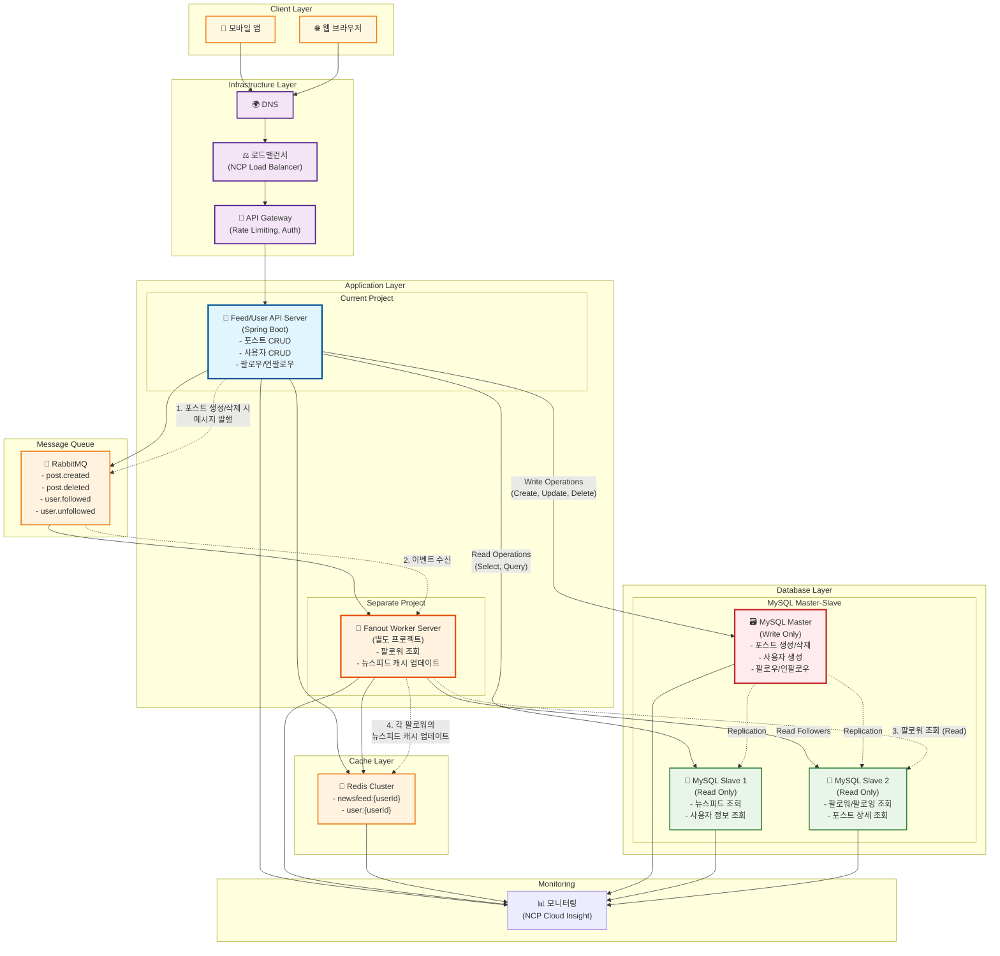

# 뉴스피드 시스템 (Newsfeed System)

> "가상 면접 사례로 배우는 대규모 시스템 설계 기초" 책을 기반으로 한 분산 뉴스피드 시스템 구현

## 📋 프로젝트 개요

대규모 뉴스피드 시스템의 핵심 기능을 분산 환경에서 구현하여 시스템 설계 원리를 학습합니다.
NCP(Naver Cloud Platform) 환경에서 캐시, 메시지 큐 연동을 통한 확장 가능한 아키텍처를 구축합니다.

## 🏗️ 시스템 아키텍처



### 🔄 분산 처리 흐름

#### 포스트 생성 시

1. **API 서버**: 포스트를 **MySQL Master**에 저장 (Write Operation)
2. **메시지 발행**: RabbitMQ에 `post.created` 이벤트 전송
3. **Fanout Worker**: 이벤트 수신 후 **MySQL Slave**에서 작성자의 팔로워 목록 조회 (Read Operation)
4. **캐시 업데이트**: 각 팔로워의 뉴스피드 캐시에 새 포스트 추가

#### 포스트 삭제 시

1. **API 서버**: **MySQL Master**에서 포스트 삭제 (Write Operation)
2. **메시지 발행**: RabbitMQ에 `post.deleted` 이벤트 전송
3. **Fanout Worker**: 모든 팔로워의 뉴스피드 캐시에서 해당 포스트 제거

#### 뉴스피드 조회 시

1. **캐시 조회**: Redis에서 `newsfeed:{userId}` 조회
2. **Cache Miss**: 캐시에 없을 경우 **MySQL Slave**에서 조회 후 캐시 저장 (Read Operation)

#### 사용자/팔로우 관리 시

- **팔로우/언팔로우**: **MySQL Master**에 저장 (Write Operation)
- **팔로워/팔로잉 목록 조회**: **MySQL Slave**에서 조회 (Read Operation)
- **사용자 정보 조회**: **MySQL Slave**에서 조회 (Read Operation)

#### 데이터베이스 복제

- **Master → Slave 복제**: 실시간 또는 준실시간으로 Master의 변경사항이 Slave에 동기화
- **읽기 부하 분산**: 여러 Slave DB를 통해 읽기 성능 향상
- **고가용성**: Master 장애 시 Slave를 Master로 승격 가능

## 🛠️ 기술 스택

### Backend

- **Language**: Java 21
- **Framework**: Spring Boot 3.5.4
- **Build Tool**: Gradle

### Database

- **Primary**: MySQL 8.0 (Master-Slave 구조)
  - **Master**: Write 전용 (포스트/사용자/팔로우 생성/수정/삭제)
  - **Slave**: Read 전용 (뉴스피드/사용자정보/팔로워목록 조회)
- **Test**: H2 Database

### Cache & Message Queue

- **Cache**: Redis 7
- **Message Queue**: RabbitMQ 3

### ORM & Data Access

- **ORM**: Spring Data JPA
- **Provider**: Hibernate

### Testing

- **Framework**: JUnit 5
- **Integration**: Spring Boot Test

### Infrastructure

- **Cloud**: NCP (Naver Cloud Platform)

## 🔌 API 명세

### Feed APIs

- `POST /api/feeds` - 포스트 생성
- `GET /api/feeds` - 뉴스피드 조회
- `DELETE /api/feeds/{postId}` - 포스트 삭제

### User APIs

- `POST /api/users` - 사용자 생성
- `GET /api/users/{userId}` - 사용자 정보 조회
- `GET /api/users/{userId}/following` - 팔로잉 목록
- `GET /api/users/{userId}/followers` - 팔로워 목록
- `POST /api/users/{userId}/follow` - 팔로우
- `DELETE /api/users/{userId}/follow` - 언팔로우

## 🏛️ 주요 컴포넌트

### 1. Feed Service

- 포스트 생성 및 관리
- 뉴스피드 생성 로직
- 캐시 전략 구현

### 2. User Service

- 사용자 관리
- 팔로우/팔로워 관계 관리
- 사용자 인증

### 3. Cache Layer (Redis)

- 뉴스피드 캐시
- 사용자 세션 캐시

### 4. Message Queue (RabbitMQ)

- **이벤트 타입**:
  - `post.created`: 포스트 생성 시 팔로워들의 뉴스피드 캐시 업데이트
  - `post.deleted`: 포스트 삭제 시 팔로워들의 캐시에서 제거
  - `user.followed`: 팔로우 시 뉴스피드 재구성
  - `user.unfollowed`: 언팔로우 시 뉴스피드에서 해당 사용자 포스트 제거
- **처리 방식**: Fanout Exchange를 통한 다중 팔로워 처리

## 📂 프로젝트 구조

```
src/
├── main/
│   ├── java/
│   │   └── com/yoonhp/newsfeed/
│   │       ├── controller/     # REST API 컨트롤러
│   │       ├── service/        # 비즈니스 로직
│   │       ├── repository/     # 데이터 접근 계층
│   │       ├── entity/         # JPA 엔티티
│   │       ├── dto/           # 데이터 전송 객체
│   │       ├── config/        # 설정 클래스
│   │       └── NewsfeedApplication.java
│   └── resources/
│       ├── application.yml
│       └── application-{profile}.yml
└── test/
    └── java/
        └── com/yoonhp/newsfeed/
```

## 🎯 개발 목표

1. **분산 시스템 설계**: 여러 서비스 간의 통신과 데이터 일관성
2. **캐시 전략**: Redis를 활용한 성능 최적화
3. **비동기 처리**: RabbitMQ를 통한 메시지 큐 활용
4. **확장성**: 대용량 트래픽 처리를 위한 아키텍처 설계

## 🚀 개발 단계

1. **Phase 1**: 기본 API 구현 (User, Feed CRUD)
2. **Phase 2**: Redis 캐시 연동
3. **Phase 3**: RabbitMQ 메시지 큐 연동
4. **Phase 4**: NCP 환경 배포 및 테스트

## 📝 주요 특징

- **간단한 구현**: 핵심 개념 학습에 집중
- **최소한의 캐시 키**: 1-2개의 주요 캐시 패턴만 구현
- **분산 환경 테스트**: 실제 클라우드 환경에서의 동작 검증

## 🔧 로컬 개발 환경 구성

```bash
# 1. Git 클론
git clone https://github.com/Yoon-HP/Virtual-Interview-01.git

# 2. 의존성 설치
./gradlew build

# 3. 로컬 인프라 실행 (Docker Compose)
docker-compose up -d

# 4. 애플리케이션 실행
./gradlew bootRun
```

## 📚 참고 자료

- "가상 면접 사례로 배우는 대규모 시스템 설계 기초" - Alex Xu
- Spring Boot 3.x Documentation
- Redis Documentation
- RabbitMQ Documentation
