# 뉴스피드 시스템 (Newsfeed System)

> "가상 면접 사례로 배우는 대규모 시스템 설계 기초" 책을 기반으로 한 분산 뉴스피드 시스템 구현

## 📋 프로젝트 개요

대규모 뉴스피드 시스템의 핵심 기능을 분산 환경에서 구현하여 시스템 설계 원리를 학습합니다.
NCP(Naver Cloud Platform) 환경에서 캐시, 메시지 큐 연동을 통한 확장 가능한 아키텍처를 구축합니다.

## 🏗️ 시스템 아키텍처

```mermaid
graph TB
    subgraph "Client Layer"
        Mobile["📱 모바일 앱"]
        Web["🌐 웹 브라우저"]
    end

    subgraph "Infrastructure Layer"
        DNS["🌍 DNS"]
        LB["⚖️ 로드밸런서<br/>(NCP Load Balancer)"]
        Gateway["🚪 API Gateway<br/>(Rate Limiting, JWT 검증,<br/>인증된 사용자 정보 추출)"]
    end

    subgraph "Application Layer"
        subgraph "Auth Service (별도 프로젝트)"
            Auth["🔐 인증/인가 서비스<br/>(Spring Boot)<br/>- 로그인/로그아웃<br/>- JWT 토큰 발급/갱신<br/>- 사용자 등록/탈퇴<br/>- 권한 관리"]
        end

        subgraph "Current Project"
            API["🔧 Feed API Server<br/>(Spring Boot)<br/>- 포스트 CRUD<br/>- 팔로우/언팔로우<br/>- 뉴스피드 조회<br/>(Header: X-User-Id 사용)"]
        end

        subgraph "Separate Project"
            Worker["👷 Fanout Worker Server<br/>(별도 프로젝트)<br/>- 팔로워 조회<br/>- 뉴스피드 캐시 업데이트"]
        end
    end

    subgraph "Message Queue"
        RabbitMQ["🐰 RabbitMQ<br/>- post.created<br/>- post.deleted<br/>- user.followed<br/>- user.unfollowed<br/>- user.registered<br/>- user.deleted"]
    end

    subgraph "Cache Layer (Redis Cluster)"
        subgraph "News Feed Cache"
            NewsFeedCache["📰 뉴스피드 캐시<br/>- newsfeed:{userId} → [postId1, postId2, ...]<br/>- 최신 포스트 ID 리스트"]
        end
        
        subgraph "Content Cache"
            ContentCache["📝 콘텐츠 캐시<br/>- post:{postId} → 포스트 상세 정보<br/>- popular:posts → 인기 포스트 리스트<br/>- general:posts → 일반 포스트 리스트"]
        end
        
        subgraph "Social Graph Cache"
            SocialCache["👥 소셜 그래프 캐시<br/>- followers:{userId} → 팔로워 ID 리스트<br/>- following:{userId} → 팔로잉 ID 리스트<br/>- user:{userId} → 사용자 프로필"]
        end
        
        subgraph "Action Cache"
            ActionCache["❤️ 행동 캐시<br/>- likes:{postId} → 좋아요한 사용자 ID 리스트<br/>- replies:{postId} → 답글 ID 리스트<br/>- actions:{postId} → 기타 행동 정보"]
        end
        
        subgraph "Counter Cache"
            CounterCache["🔢 카운터 캐시<br/>- like_count:{postId} → 좋아요 수<br/>- reply_count:{postId} → 답글 수<br/>- follower_count:{userId} → 팔로워 수<br/>- following_count:{userId} → 팔로잉 수"]
        end
        
        subgraph "Auth Cache"
            AuthCache["🔐 인증 캐시<br/>- jwt:{token} → 토큰 정보<br/>- blacklist:{token} → 무효화된 토큰"]
        end
    end

    subgraph "Database Layer"
        subgraph "Auth Database"
            AuthDB["🔐 Auth MySQL<br/>(Master-Slave)<br/>- 사용자 계정<br/>- 권한 정보<br/>- 토큰 블랙리스트"]
        end

        subgraph "Feed Database"
            subgraph "MySQL Master-Slave"
                MasterDB["🗃️ Feed MySQL Master<br/>(Write Only)<br/>- 포스트 생성/삭제<br/>- 팔로우/언팔로우<br/>- 사용자 프로필 동기화"]
                SlaveDB1["📖 Feed MySQL Slave 1<br/>(Read Only)<br/>- 뉴스피드 조회<br/>- 사용자 프로필 조회"]
                SlaveDB2["📖 Feed MySQL Slave 2<br/>(Read Only)<br/>- 팔로워/팔로잉 조회<br/>- 포스트 상세 조회"]
            end
        end
    end

    subgraph "Monitoring"
        Monitor["📊 모니터링<br/>(NCP Cloud Insight)"]
    end

    %% Client Flow
    Mobile --> DNS
    Web --> DNS
    DNS --> LB
    LB --> Gateway

    %% Authentication Flow
    Gateway -->|"1. JWT 토큰 검증<br/>2. X-User-Id 헤더 추가"| API
    Gateway -->|"로그인/회원가입 요청"| Auth

    %% API Server Operations
    API -->|"Write Operations<br/>(Create, Update, Delete)"| MasterDB
    API -->|"Read Operations<br/>(Select, Query)"| SlaveDB1
    API --> NewsFeedCache
    API --> ContentCache
    API --> SocialCache
    API --> ActionCache
    API --> CounterCache
    API --> RabbitMQ

    %% Auth Service Operations
    Auth --> AuthDB
    Auth --> AuthCache

    %% Worker Operations
    Worker -->|"Read Followers"| SlaveDB2
    Worker --> NewsFeedCache
    Worker --> ContentCache
    Worker --> SocialCache
    Worker --> CounterCache

    %% Database Replication
    MasterDB -.->|"Replication"| SlaveDB1
    MasterDB -.->|"Replication"| SlaveDB2

    %% Message Queue Flow
    RabbitMQ --> Worker

    %% Cross-service Communication
    Auth -->|"사용자 이벤트 발행"| RabbitMQ

    %% Monitoring
    API --> Monitor
    Auth --> Monitor
    Worker --> Monitor
    NewsFeedCache --> Monitor
    ContentCache --> Monitor
    SocialCache --> Monitor
    ActionCache --> Monitor
    CounterCache --> Monitor
    AuthCache --> Monitor
    MasterDB --> Monitor
    SlaveDB1 --> Monitor
    SlaveDB2 --> Monitor
    AuthDB --> Monitor

    %% Annotations
    API -.->|"1. 포스트 생성/삭제 시<br/>메시지 발행"| RabbitMQ
    RabbitMQ -.->|"2. 이벤트 수신"| Worker
    Worker -.->|"3. 팔로워 조회 (Read)"| SlaveDB2
    Worker -.->|"4. 각 팔로워의<br/>뉴스피드 캐시 업데이트"| NewsFeedCache

    classDef currentProject fill:#e1f5fe,stroke:#01579b,stroke-width:3px
    classDef separateProject fill:#fff3e0,stroke:#e65100,stroke-width:3px
    classDef authService fill:#ffebee,stroke:#c62828,stroke-width:3px
    classDef infrastructure fill:#f3e5f5,stroke:#4a148c,stroke-width:2px
    classDef masterdb fill:#ffebee,stroke:#c62828,stroke-width:3px
    classDef slavedb fill:#e8f5e8,stroke:#2e7d32,stroke-width:2px
    classDef datastore fill:#fff3e0,stroke:#ef6c00,stroke-width:2px
    classDef client fill:#fff8e1,stroke:#f57f17,stroke-width:2px

    class API currentProject
    class Worker separateProject
    class Auth authService
    class DNS,LB,Gateway infrastructure
    class MasterDB masterdb
    class SlaveDB1,SlaveDB2 slavedb
    class Redis,RabbitMQ datastore
    class Mobile,Web client
```



### 🔄 분산 처리 흐름

#### 인증/인가 처리

1. **클라이언트**: JWT 토큰을 Authorization 헤더에 포함하여 요청
2. **API Gateway**: JWT 토큰 검증 및 사용자 ID 추출
3. **헤더 추가**: `X-User-Id` 헤더에 사용자 ID를 추가하여 백엔드 서비스로 전달
4. **서비스 처리**: 각 서비스는 헤더의 사용자 ID를 신뢰하여 처리

#### 사용자 등록 시

1. **Auth Service**: 사용자 정보를 **Auth MySQL**에 저장
2. **메시지 발행**: RabbitMQ에 `user.registered` 이벤트 전송
3. **Feed Service**: 이벤트 수신 후 사용자 프로필 테이블에 기본 정보 생성
4. **사용자 동기화**: Auth Service의 사용자 정보가 Feed Service에 실시간 동기화

#### 포스트 생성 시

1. **API Gateway**: JWT 검증 후 `X-User-Id` 헤더 추가
2. **Feed Service**: 포스트를 **Feed MySQL Master**에 저장 (Write Operation)
3. **메시지 발행**: RabbitMQ에 `post.created` 이벤트 전송
4. **Fanout Worker**: 이벤트 수신 후 **Feed MySQL Slave**에서 작성자의 팔로워 목록 조회 (Read Operation)
5. **캐시 업데이트**: 각 팔로워의 뉴스피드 캐시에 새 포스트 추가

#### 포스트 삭제 시

1. **API Gateway**: JWT 검증 후 `X-User-Id` 헤더 추가
2. **Feed Service**: **Feed MySQL Master**에서 포스트 삭제 (Write Operation)
3. **메시지 발행**: RabbitMQ에 `post.deleted` 이벤트 전송
4. **Fanout Worker**: 모든 팔로워의 뉴스피드 캐시에서 해당 포스트 제거

#### 뉴스피드 조회 시 (캐시 우선 전략)

1. **API Gateway**: JWT 검증 후 `X-User-Id` 헤더 추가
2. **뉴스피드 캐시 조회**: `newsfeed:{userId}`에서 포스트 ID 리스트 조회
3. **콘텐츠 캐시 조회**: 각 포스트 ID에 대해 `post:{postId}` 조회
4. **Cache Miss 처리**:
   - 뉴스피드 캐시 미스: **Feed MySQL Slave**에서 팔로워 포스트 조회 후 캐시 저장
   - 포스트 캐시 미스: **Feed MySQL Slave**에서 포스트 상세 조회 후 캐시 저장
5. **소셜 그래프 캐시**: 사용자 프로필 정보 조회 (`user:{userId}`)
6. **카운터 캐시**: 좋아요 수, 답글 수 등 조회 (`like_count:{postId}`, `reply_count:{postId}`)

#### 팔로우/언팔로우 시

1. **API Gateway**: JWT 검증 후 `X-User-Id` 헤더 추가
2. **Feed Service**: 
   - `X-User-Id`에서 userA_id 확인
   - `{userId}` 파라미터에서 userB_id 확인
   - **Feed MySQL**에서 userB의 프로필 정보 조회 (동기화된 데이터)
   - 팔로우 관계를 **Feed MySQL Master**에 저장 (Write Operation)
3. **메시지 발행**: RabbitMQ에 `user.followed`/`user.unfollowed` 이벤트 전송
4. **Fanout Worker**: 뉴스피드 캐시 재구성

#### 데이터베이스 분리

- **Auth Database**: 사용자 계정, 권한, 토큰 관리 전용
- **Feed Database**: 포스트, 팔로우 관계, 뉴스피드 전용
- **독립적 확장**: 각 도메인별로 독립적인 스케일링 가능

## 🛠️ 기술 스택

### Backend

- **Language**: Java 21
- **Framework**: Spring Boot 3.5.4
- **Build Tool**: Gradle

### Database

- **Primary**: MySQL 8.0 (Master-Slave 구조)
  - **Master**: Write 전용 (포스트/사용자/팔로우 생성/수정/삭제)
  - **Slave**: Read 전용 (뉴스피드/사용자정보/팔로워목록 조회)
- **Test**: H2 Database

### Cache & Message Queue

- **Cache**: Redis 7
- **Message Queue**: RabbitMQ 3

### ORM & Data Access

- **ORM**: Spring Data JPA
- **Provider**: Hibernate

### Testing

- **Framework**: JUnit 5
- **Integration**: Spring Boot Test

### Infrastructure

- **Cloud**: NCP (Naver Cloud Platform)

## 🔌 API 명세

### Auth APIs (별도 서비스)

- `POST /auth/register` - 사용자 등록
- `POST /auth/login` - 로그인 (JWT 토큰 발급)
- `POST /auth/logout` - 로그아웃 (토큰 무효화)
- `POST /auth/refresh` - 토큰 갱신
- `DELETE /auth/users/{userId}` - 사용자 탈퇴

### Feed APIs

- `POST /api/feeds` - 포스트 생성 (Header: X-User-Id)
- `GET /api/feeds` - 뉴스피드 조회 (Header: X-User-Id)
- `DELETE /api/feeds/{postId}` - 포스트 삭제 (Header: X-User-Id)

### User Profile APIs

- `GET /api/users/{userId}` - 사용자 프로필 조회
- `GET /api/users/{userId}/following` - 팔로잉 목록
- `GET /api/users/{userId}/followers` - 팔로워 목록
- `POST /api/users/{userId}/follow` - 팔로우 (Header: X-User-Id)
- `DELETE /api/users/{userId}/follow` - 언팔로우 (Header: X-User-Id)

## 🏛️ 주요 컴포넌트

### 1. API Gateway

- **JWT 토큰 검증**: 모든 요청에 대한 토큰 유효성 검사
- **사용자 정보 추출**: JWT에서 사용자 ID를 추출하여 `X-User-Id` 헤더로 전달
- **Rate Limiting**: API별 요청 제한
- **라우팅**: 서비스별 요청 분산

### 2. Auth Service (별도 프로젝트)

- **사용자 등록/탈퇴**: 계정 관리
- **로그인/로그아웃**: JWT 토큰 발급 및 무효화
- **토큰 갱신**: Access Token 갱신
- **권한 관리**: 사용자 권한 및 역할 관리

### 3. Feed Service

- **포스트 관리**: CRUD 작업 (Header의 X-User-Id 사용)
- **뉴스피드 생성**: 팔로워 기반 뉴스피드 구성
- **팔로우/언팔로우**: 사용자 관계 관리
- **캐시 전략**: Redis를 활용한 성능 최적화

### 4. Cache Layer (Redis Cluster)

#### 📰 뉴스피드 캐시
- **키**: `newsfeed:{userId}`
- **값**: 포스트 ID 리스트 (최신순)
- **TTL**: 1시간
- **용도**: 사용자별 뉴스피드 포스트 ID 목록

#### 📝 콘텐츠 캐시
- **키**: `post:{postId}`
- **값**: 포스트 상세 정보 (JSON)
- **TTL**: 24시간
- **용도**: 포스트 내용, 작성자, 생성일 등

#### 👥 소셜 그래프 캐시
- **키**: `followers:{userId}`, `following:{userId}`, `user:{userId}`
- **값**: 사용자 ID 리스트 또는 프로필 정보
- **TTL**: 6시간
- **용도**: 팔로워/팔로잉 관계, 사용자 프로필

#### ❤️ 행동 캐시
- **키**: `likes:{postId}`, `replies:{postId}`
- **값**: 사용자 ID 리스트 또는 답글 정보
- **TTL**: 12시간
- **용도**: 좋아요, 답글 등 사용자 행동 정보

#### 🔢 카운터 캐시
- **키**: `like_count:{postId}`, `reply_count:{postId}`, `follower_count:{userId}`
- **값**: 숫자 (카운터)
- **TTL**: 30분
- **용도**: 좋아요 수, 답글 수, 팔로워 수 등

#### 🔐 인증 캐시
- **키**: `jwt:{token}`, `blacklist:{token}`
- **값**: 토큰 정보 또는 블랙리스트 플래그
- **TTL**: 토큰 만료시간
- **용도**: JWT 토큰 검증 및 블랙리스트 관리

### 5. Message Queue (RabbitMQ)

- **이벤트 타입**:
  - `post.created`: 포스트 생성 시 팔로워들의 뉴스피드 캐시 업데이트
  - `post.deleted`: 포스트 삭제 시 팔로워들의 캐시에서 제거
  - `user.followed`: 팔로우 시 뉴스피드 재구성
  - `user.unfollowed`: 언팔로우 시 뉴스피드에서 해당 사용자 포스트 제거
  - `user.registered`: 새 사용자 등록 시 초기 데이터 설정
  - `user.deleted`: 사용자 탈퇴 시 관련 데이터 정리
- **처리 방식**: Fanout Exchange를 통한 다중 팔로워 처리

## 📂 프로젝트 구조

// todo

## 🎯 개발 목표

1. **분산 시스템 설계**: 여러 서비스 간의 통신과 데이터 일관성
2. **캐시 전략**: Redis를 활용한 성능 최적화
3. **비동기 처리**: RabbitMQ를 통한 메시지 큐 활용
4. **확장성**: 대용량 트래픽 처리를 위한 아키텍처 설계

## 🚀 개발 단계

1. **Phase 1**: 기본 Feed API 구현 (포스트 CRUD, 팔로우/언팔로우)
2. **Phase 2**: Redis 캐시 연동 (뉴스피드 캐시)
3. **Phase 3**: RabbitMQ 메시지 큐 연동 (Fanout Worker)
4. **Phase 4**: Auth Service 구현 (별도 프로젝트)
5. **Phase 5**: API Gateway 연동 (JWT 검증, X-User-Id 헤더)
6. **Phase 6**: NCP 환경 배포 및 테스트

## 📝 주요 특징

- **캐시 우선 전략**: 뉴스피드 조회 시 DB 대신 캐시 우선 사용
- **5계층 캐시 구조**: 뉴스피드, 콘텐츠, 소셜그래프, 행동, 카운터
- **분산 캐시**: Redis Cluster를 통한 고가용성 및 확장성
- **실제 구현**: 분산환경 캐시 서버에 맞춘 구현

## 🔧 캐시 구현 예시

### 뉴스피드 조회 (캐시 우선)
```java
@Service
public class NewsFeedService {
    
    public List<Post> getNewsFeed(Long userId) {
        // 1. 뉴스피드 캐시에서 포스트 ID 리스트 조회
        String newsFeedKey = "newsfeed:" + userId;
        List<String> postIds = redisTemplate.opsForList()
            .range(newsFeedKey, 0, 49); // 최근 50개
        
        if (postIds == null || postIds.isEmpty()) {
            // Cache Miss: DB에서 조회 후 캐시 저장
            return loadNewsFeedFromDB(userId);
        }
        
        // 2. 각 포스트의 상세 정보를 콘텐츠 캐시에서 조회
        List<Post> posts = new ArrayList<>();
        for (String postId : postIds) {
            String postKey = "post:" + postId;
            Post post = redisTemplate.opsForValue().get(postKey);
            
            if (post == null) {
                // 포스트 캐시 미스: DB에서 조회 후 캐시 저장
                post = loadPostFromDB(Long.valueOf(postId));
                redisTemplate.opsForValue().set(postKey, post, 24, TimeUnit.HOURS);
            }
            posts.add(post);
        }
        
        return posts;
    }
}
```

### 팔로우 시 캐시 업데이트
```java
@EventListener
public void handleUserFollowed(UserFollowedEvent event) {
    Long followerId = event.getFollowerId();
    Long followingId = event.getFollowingId();
    
    // 1. 팔로워의 뉴스피드 캐시에 팔로잉의 최근 포스트 추가
    String newsFeedKey = "newsfeed:" + followerId;
    List<Post> recentPosts = postRepository.findByUserIdOrderByCreatedAtDesc(followingId, 20);
    
    for (Post post : recentPosts) {
        redisTemplate.opsForList().leftPush(newsFeedKey, post.getId().toString());
    }
    
    // 2. 팔로워 수 카운터 업데이트
    String followerCountKey = "follower_count:" + followingId;
    redisTemplate.opsForValue().increment(followerCountKey);
    
    // 3. 소셜 그래프 캐시 업데이트
    String followersKey = "followers:" + followingId;
    redisTemplate.opsForSet().add(followersKey, followerId.toString());
    
    String followingKey = "following:" + followerId;
    redisTemplate.opsForSet().add(followingKey, followingId.toString());
}
```

## 🔧 로컬 개발 환경 구성

```bash
# 1. Git 클론
git clone https://github.com/Yoon-HP/Virtual-Interview-01.git

# 2. 의존성 설치
./gradlew build

# 3. 로컬 인프라 실행 (Docker Compose)
docker-compose up -d

# 4. 애플리케이션 실행
./gradlew bootRun
```

## 📚 참고 자료

- "가상 면접 사례로 배우는 대규모 시스템 설계 기초" - Alex Xu
- Spring Boot 3.x Documentation
- Redis Documentation
- RabbitMQ Documentation
